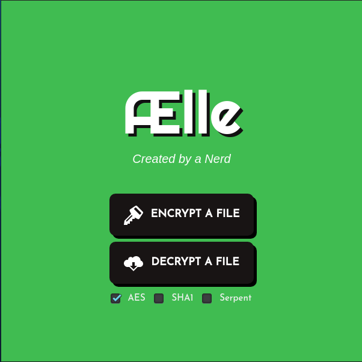

# Ælle

- [Versão em potuguês](/README.md)

It is a desktop application, developed using Electron to encrypt and decrypt files. Any file can be encrypted, but the computing power required is proportional to the size of the file.

***
## [Download for Linux](https://github.com/G4BR-13-L/Aelle-encrypter/releases)
***

## Screenshot



## Building
1. clone the repository

```
git clone https://github.com/G4BR-13-L/Aelle-encrypter.git
```

2. Enter the repository folder

```
cd Aelle-encrypter
```

3. Install dependencies with npm

```
npm install
```

4. Run
```
npm start
```